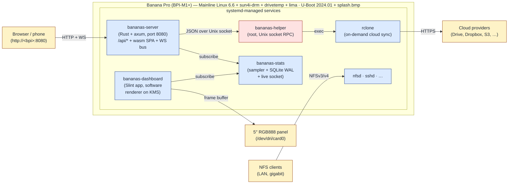

<div align="center">
  

  <h1>BanaNAS</h1>

  <p>
    <a href="https://github.com/rubeniskov/bananas/actions/workflows/ci.yml"></a>
    <a href="https://github.com/rubeniskov/bananas/releases/latest"></a>
    <a href="LICENSE"></a>
  </p>

  <p>
    <strong>A Yocto-based, batteries-included NAS distribution for the Banana Pro (BPI-M1+, Allwinner A20).</strong><br/>
    Web admin · NFS exports · live stats dashboard on the LCD · cloud sync · all over a 5″ panel and a 5 W SoC.
  </p>

  <p>
    <a href="#-features">Features</a> ·
    <a href="#-quick-start">Quick start</a> ·
    <a href="#-architecture">Architecture</a> ·
    <a href="#-screenshots">Screenshots</a> ·
    <a href="docs/hardware-references">Hardware refs</a> ·
    <a href="CONTRIBUTING.md">Contributing</a>
  </p>
</div>

---

## 🍌 Why?

Off-the-shelf NAS boxes either cost a lot, lock you into a vendor cloud, or both. The Banana Pro has just enough horsepower for a quiet, always-on home file server (gigabit Ethernet, native SATA, USB hosts, a 5″ touch-friendly LCD panel) — but turning a bare board into a *usable* NAS means stitching together a bootloader, kernel, init system, NFS daemon, an admin UI, sync engine, splash screens, status displays, and the world's worst per-device cross-compile dance.

**BanaNAS bundles all of that into one Yocto image.** Build it from source with a single `pixi run iterate`, drop it on an SD card, plug in a SATA disk, and you get:

- A wired-only NFS server with a friendly web admin.
- A live stats dashboard on the on-board LCD.
- Backup-to-Google-Drive (and 5 other providers) without manual `rclone.conf` edits.
- A boot story (U-Boot logo → progress bar → live tiles) that doesn't look like a hobbyist project.
- A reproducible image you can rebuild months later because every dep is pinned in `kas.yml` + `pixi.lock`.

Reproducibility, low idle power, no cloud lock-in, and "your own data, your own metal" — that's the goal.

---

## ✨ Features

### NAS core

- **Yocto / scarthgap-based image** — pinned upstream layers, reproducible bake from `pixi run build`.
- **Mainline Linux 6.6** with CPU clock + Banana-Pro LCD-panel patches and a `panel-simple`-driven 800×480 RGB888 DPI panel wired through `tcon0`.
- **NFS v3/v4 server** with `all_squash`, sane `noexec`/`nosuid`/`x-systemd.device-timeout` defaults baked into `/etc/fstab`.
- **SATA + USB storage** with `e2fsprogs-resize2fs`, `tune2fs`, `mke2fs`, `e2fsck`, `gptfdisk` for on-device partition surgery (within the 16 TiB pgoff_t cap on this 32-bit ARM SoC — see the GPT memo in [`docs/`](docs)).
- **systemd** with key-only SSH, baked-in `authorized_keys`, optional root password (SHA-512 hash injected via `ROOT_PASSWORD_HASH`).

### Web admin (`crates/server` + `crates/ui`)

- Single-page Dioxus 0.7 wasm UI served alongside a JSON `/api/*` from a Rust HTTP server.
- Hash-based routing — every tab survives a full-page reload.
- Tabs: **Stats**, **Exports**, **Storage** (mount points), **Users**, **Cloud**.
- **Per-row Permissions modal** (chown / chmod / recursive) routed through a privileged helper, allowlisted to `/srv /mnt /media /home /opt`.
- **Save / Load Config** as a single TOML bundle — exports + fstab + users (with shadow hashes) + cloud accounts + sync entries all round-trip.
- **Protected fstab rows** (system mounts) render with a lock icon and refuse edits/deletes server-side; the "save config" path filters them out so backups stay clean.
- Live **WebSocket stats** at `/api/stats/live` — N web clients = ONE socket subscription to the stats daemon, regardless of N.

### LCD dashboard (`crates/dashboard`)

- Slint 1.16 app on the 5″ panel, software renderer (Mali-400 GPU acceleration scaffolding is present but gated behind a feature flag — flip it once a working lima userspace ships in our sysroot).
- Renders straight to `/dev/dri/card0` via `linuxkms-noseat` — no X server, no Wayland.
- Live tiles: **CPU**, **Memory**, **Network** sparklines (per iface), **Disk I/O** sparklines (per device), **Partitions** with usage bars, **Temperatures** chip strip (CPU on-die + per-disk SMART via the kernel `drivetemp` module).
- Subscribes to bananas-stats's Unix socket — no SQLite reads on the live path.

### Persistent stats (`crates/stats`)

- Sampler + writer over a WAL'd SQLite at `/var/lib/bananas/stats.db`.
- 1 Hz sampling, 5 s flush window, 24 h raw retention + 30 d 1-minute aggregates by default — all knobs editable through the web UI's Stats config form.
- Auto-sized DB budget (5 % of free space, capped at 100 MiB) with hourly retention sweeps.
- Live Unix-socket pub/sub at `/run/bananas-stats/live.sock` — both the dashboard and the web admin's WebSocket bus subscribe here, so live data never round-trips through SQLite.

### Cloud sync (`crates/server` + helper, vendored rclone)

- New **Cloud** tab with Accounts and Sync entries panels.
- Provider catalog: Google Drive, Dropbox, OneDrive, S3-compatible, WebDAV, FTP — extensible via a one-line const append.
- Account tokens (rclone-authorize JSON) stored in `/etc/bananas/cloud.toml`, redacted from the API GET response, included in TOML config bundles.
- Run-on-demand syncs invoke `rclone` with **env-var-only config** — the access token never hits disk during a sync (`RCLONE_CONFIG=/dev/null` + `RCLONE_CONFIG_<NAME>_TOKEN=…`).
- Privilege drop from root → `bananas` user before exec so synced files inherit the right ownership under `/srv/*`.

### Boot polish

- **U-Boot splash** on the LCD via `CONFIG_SPLASH_SCREEN` + a 24 bpp 800×480 BMP shipped on the FAT boot partition.
- **psplash** with a banana-yellow progress bar + the BanaNAS logo through the kernel→userspace handoff.
- Quiet kernel cmdline (`quiet loglevel=3 vt.global_cursor_default=0`) so fbcon doesn't draw over the splash.
- WiFi firmware blacklist (`brcmfmac` is unsupported on this image — kills the 13 s of boot-time spam).

### Build pipeline (`pixi.toml`)

- `pixi run iterate` — full loop: build UI (wasm via `dx build`), cross-compile Rust crates for armv7 (cargo-zigbuild for server/helper/stats, cross-rs for the Slint dashboard), bake Yocto image, stage TFTP, soft-reboot the BPI, extract rootfs over NFS, restart compose containers.
- Network-boot iteration over TFTP + NFS via `compose.yml` (no SD-card flashes per change).
- Failure-fast `pixi run build` — bake errors propagate cleanly instead of silently shipping the previous build.

---

## 📸 Screenshots

### Web admin

Web UI tabs across the three most-used surfaces — Exports, Storage, and Users.

| | |
| :-: | :-: |
| **NFS exports** | **Mount points** |
|  |  |
| **Users** | |
|  | |

### LCD dashboard

Slint app rendered on the 5″ RGB panel — CPU + memory bars in the header, network and disk sparklines side-by-side, partition usage bars across the bottom.


---

## 🚀 Quick start

> **Hardware:** Banana Pro (BPI-M1+) with a microSD card, optional 5″ RGB888 LCD, optional SATA disk(s).

### 0. Host requirements

`pixi` provides Python 3.11, `kas`, and the conda-side host tools. Bitbake also needs a couple of system packages:

| OS | Command |
|----|---------|
| Ubuntu / Debian | `sudo apt-get install chrpath cpio diffstat hostname rpcsvc-proto` |
| Arch | `sudo pacman -S chrpath cpio diffstat inetutils rpcsvc-proto` |
| macOS | Yocto builds are not supported on macOS host — use a Linux VM / Docker. |
| Windows | Use WSL2 (Ubuntu) — `sudo apt-get install chrpath cpio diffstat hostname rpcsvc-proto`. |

You also need a Docker context pointed at the host's native daemon (Docker Desktop's VM context can't bind LAN UDP for TFTP / NFS). Once per machine:

```bash
docker context use default
```

### 1. Clone + drop your SSH key

```bash
git clone https://github.com/rubeniskov/bananas.git && cd bananas
cp ~/.ssh/id_ed25519.pub layers/meta-bananas/recipes-core/images/files/authorized_keys
```

The image bakes `authorized_keys` into `${ROOT_HOME}/.ssh/` so `pixi run reboot` works over SSH key auth right after first boot.

### 2. First build

```bash
pixi run info       # sanity check (pixi + kas versions, etc.)
pixi run build      # full Yocto bake (≈30 min cold cache)
```

Output lands at `build/tmp/deploy/images/bananapro/bananas-image-bananapro.rootfs.tar.gz`.

### 3. Network-boot setup (one-time)

The TFTP + NFS containers run via `compose.yml` (host's native daemon). On a new machine, disable any system NFS server first since the kernel `nfsd` module is shared:

```bash
sudo systemctl disable --now nfs-server
lsmod | grep -q '^nfsd' || sudo modprobe nfsd
```

Then the BPI's U-Boot env (one-time, paste over the serial console then `saveenv`):

```
setenv serverip <host-ip>
setenv ipaddr <bpi-static-ip>
setenv netargs 'setenv bootargs console=ttyS0,115200 root=/dev/nfs nfsroot=<host-ip>:/nfsshare,vers=3 ip=dhcp panic=10'
setenv bootcmd_net 'run netargs; tftpboot 0x42000000 uImage; tftpboot 0x43000000 sun7i-a20-bananapro.dtb; bootm 0x42000000 - 0x43000000'
setenv bootcmd 'run bootcmd_net'
saveenv
```

### 4. Iterate

```bash
BPI_HOST=<bpi-host-or-ip> pixi run iterate
```

This rebuilds everything, soft-reboots the BPI, and streams the new rootfs back over NFS. Subsequent iterations on a UI-only change typically take under a minute.

### 5. Web admin

Browse to `http://<bpi-host>:8080/` — first sign-in is **root / bananas**, the placeholder password the image ships with. The login form will immediately bounce you into a "Set a new password to continue" screen (PAM does the same on the serial console); that's the rotation mechanism, and the placeholder credential stops working the moment you set a new one. After rotation, add normal admin users from the Users tab and demote root to emergency-use.

If you'd rather have your own hash baked into the image (skipping the placeholder), set `ROOT_PASSWORD_HASH` in `.env`:

```bash
# Generate a hash for ROOT_PASSWORD_HASH (optional)
openssl passwd -6 -salt $(openssl rand -hex 8)
```

---

## 🏗 Architecture



### Crate map

| Crate | Target | Purpose |
|-------|--------|---------|
| `crates/helper` | armv7 host bin | Privileged ops (NFS exports rewrite, fstab edit, user mgmt, chown/chmod, smartctl, rclone). Listens on `/run/bananas/helper.sock`. |
| `crates/server` | armv7 host bin | HTTP / WebSocket server, port 8080. JSON `/api/*` + bundled wasm SPA. Routes everything sensitive through the helper. |
| `crates/ui` | wasm32 | Dioxus 0.7 SPA. Bundled into `/usr/share/bananas/ui/`. |
| `crates/stats` | armv7 host bin + lib | Sampler daemon. Writes SQLite, publishes live snapshots over `/run/bananas-stats/live.sock`. |
| `crates/dashboard` | armv7 host bin | Slint app. Subscribes to the stats live socket; renders on `/dev/fb0`. |

### Layer map

| Layer | Priority | What's there |
|-------|----------|--------------|
| `meta-bananas` (this repo) | 8 | Distro `bananas`, machine `bananapro`, all the BanaNAS-specific recipes (server, helper, stats, dashboard, modprobe blacklist, U-Boot splash, psplash override, mesa-gl x11-strip bbappend, …). |
| `meta-sunxi` | 10 | Allwinner BSP — kernel patches, U-Boot defconfig, machine fragments. |
| `meta-openembedded/{meta-oe,meta-python,meta-networking,meta-filesystems}` | 6 | Recipes for `ttf-dejavu`, runtime libs, fonts, … |
| `meta-arm` | 5 | ARM-specific bits. |
| `poky/{meta,meta-poky,meta-yocto-bsp}` | 5 | Yocto core. |

---

## 📚 References

Picked up over months of stitching this together — useful when something inevitably needs digging.

### Hardware (LeMaker BananaPro datasheets, archived in [`docs/hardware-references/`](docs/hardware-references))

- 7 / 10.1 inch LCD module instructions
- WiFi driver setup
- Audio, camera, CAN bus, GPIO library, GPU, Hardware spec, LCD module, Pin definition, Quick start, UART, WiFi configuration

### Toolchain & SoC

- [Linux-sunxi A20 page](https://linux-sunxi.org/A20)
- [Linux-sunxi mainline kernel howto](https://linux-sunxi.org/Mainline_Kernel_Howto)
- [Linux-sunxi possible setups for hacking on mainline](https://linux-sunxi.org/Possible_setups_for_hacking_on_mainline)
- [Linux-sunxi U-Boot manual build howto](https://linux-sunxi.org/Manual_build_howto#Build_U-Boot)
- [Linux-sunxi Device Tree page](https://linux-sunxi.org/Device_Tree)
- [Linux-sunxi DVFS](https://linux-sunxi.org/A20#DVFS)

### Distros & images for context

- [Arch Linux ARM — Cubietruck (closest A20 reference)](https://archlinuxarm.org/platforms/armv7/allwinner/cubietruck)
- [xnux.eu — install Arch Linux ARM on sunxi](https://xnux.eu/howtos/install-arch-linux-arm.html)

### LCD & DT overlays

- [Armbian — BananaPro LeMaker 5″ LCD legacy kernel thread](https://forum.armbian.com/topic/841-bananapro-lemaker-5in-lcd-legacy-kernel/)
- [Armbian — sun4i-drm and LCD panels thread](https://forum.armbian.com/topic/14560-sun4i-drm-and-lcd-panels/)
- [LeMaker fex_configuration repo](https://github.com/LeMaker/fex_configuration/blob/master/README.md)
- [TI — How to enable DT overlays in Linux](https://software-dl.ti.com/processor-sdk-linux/esd/AM62X/09_01_00_08/exports/docs/linux/How_to_Guides/Target/How_to_enable_DT_overlays_in_linux.html)
- [wens/dt-overlays](https://github.com/wens/dt-overlays/tree/master)

### LCD-specific configuration in this repo

- [`docs/LCD_5INCH_CONFIGURATION.md`](docs/LCD_5INCH_CONFIGURATION.md) — panel timings, DT changes, U-Boot config knobs.

---

## 🧑‍💻 Contributing

See [CONTRIBUTING.md](CONTRIBUTING.md) for the dev-environment setup, the iterate loop, code style, and the conventional-commit format that drives semantic-release.

## 📜 License

[MIT](LICENSE) — © 2026 rubeniskov.
